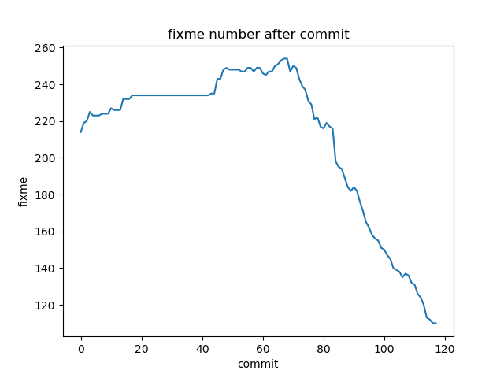

# BMBT
```
 ______________________________________
< BMBT is Bare Metal Binary Translator >
 --------------------------------------
   \
    \
        .--.
       |o_o |
       |:_/ |
      //   \ \
     (|     | )
    /'\_   _/`\
    \___)=(___/
```



## Introduction
这个项目的想法是，一个 3A5000 电脑开机之后，然后开机之后就是 Windows 。
基本思路是让 BIOS 启动之后，然后执行 BMBT，进而让 guest OS 来引导启动。
这样就可以:
1. 在二进制翻译上充分利用硬件资源加速
2. 避免 QEMU 和 Linux 的软件栈的复杂性

## LoongArch Manual
Please contact huxueshi@loongson.cn

## QA
1. 为什么需要将 TCG engine 移植过来
    - 因为 helper 函数需要

2. 为什么可以设备直通？
    - 因为很多设备和架构是无关的，这就是为什么设备驱动在 Linux 内核 arch 文件夹中几乎没有设备驱动

## Contributor
As for collaboration, please follow [these instructions](./CONTRIBUTING.md)

This project is fairly tricky for beginner, we also write some [documents for newbie](./doc/newbie.md)
